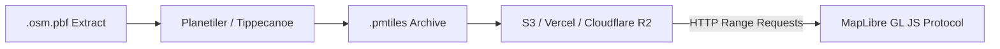

# PMTiles Pipeline & Vector Map Documentation

This document describes the PMTiles pipeline, storage architecture, HTTP Range Request behavior, MapLibre GL JS integration, and reproducible update process for GoTogetherRides.

---

## 1. Source Data
- **Primary Source**: OpenStreetMap (OSM) vector data extracts provided by [Geofabrik](https://download.geofabrik.de/) or [Overpass API](https://overpass-api.de/).
- **Initial Regional Extract**: Telangana / Southern India (`southern-zone-latest.osm.pbf`).
- **Data Licensing**: Open Database License (ODbL) requiring explicit OpenStreetMap attribution.

---

## 2. Generation Process
PMTiles is a single-file archive format for vector tile pyramids based on HTTP Range Requests.



### Steps:
1. **Download OSM PBF Extract**:
   ```bash
   curl -L -o southern-zone.osm.pbf https://download.geofabrik.de/asia/india/southern-zone-latest.osm.pbf
   ```
2. **Run Planetiler**:
   ```bash
   java -jar planetiler.jar --osm-path=southern-zone.osm.pbf --output=hyderabad.pmtiles
   ```
3. **Verify Header & Metadata**:
   ```bash
   npx pmtiles show public/map/hyderabad.pmtiles
   ```

---

## 3. Storage & HTTP Range Request Behavior
- **Zero Server Infrastructure**: PMTiles eliminates the need for running containerized tile server instances (e.g. TileServer GL / Martin).
- **HTTP Range Requests**: Browsers issue standard `Range: bytes=1024-4096` HTTP headers to fetch only the exact vector tile bytes required for the current viewport.
- **Storage Options**: AWS S3, Cloudflare R2, Vercel Static Files, or any CDN supporting HTTP Byte-Range requests (`206 Partial Content`).

---

## 4. MapLibre Integration
```javascript
// Register PMTiles Protocol
const protocol = new pmtiles.Protocol();
maplibregl.addProtocol("pmtiles", protocol.tile);

// Initialize Map
const map = new maplibregl.Map({
  container: 'map',
  style: 'pmtiles://https://your-cdn.com/map/hyderabad.pmtiles'
});
```

---

## 5. Region Expansion & Update Process
To expand or update map coverage for a new city or country:
1. Download target region `.osm.pbf` extract.
2. Execute Planetiler to compile updated `.pmtiles` archive.
3. Upload archive to static CDN bucket.
4. Update `PMTILES_URL` environment variable.
